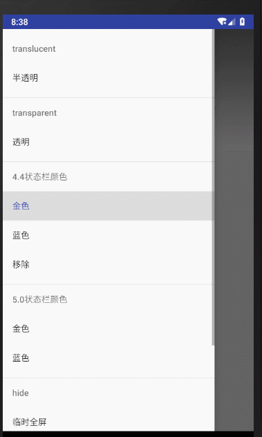

## 引入

```
implementation 'tech.liujin:system-ui:1.0.0'
```


## 使用

### 半透明

```
SystemUi.translucentStatus( this );
```


### 全透明

```
SystemUi.transparentStatus( this );
```


### 设置颜色

1.替换状态栏方式

```
SystemUi.setKitkatStatusColor(
    Gold44Activity.this,
    getColorFromRes( R.color.gold )
);
```


2.使用`5.0`API

```
SystemUi.setLollipopStatusColor(
    Gold50Activity.this,
    getColorFromRes( R.color.gold )
);
```




### 临时全屏

```
SystemUi.fullScreenTemporary(
    MainActivity.this
);
```


### 沉浸式

```
SystemUi.fullScreenTemporary(
    MainActivity.this
);
```


